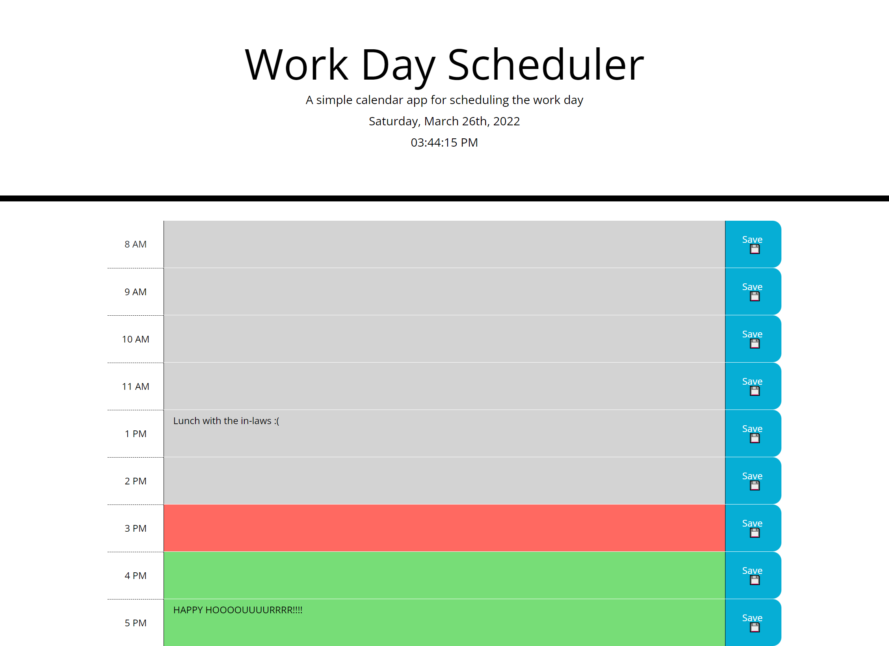

# Workday Scheduler 
## Vladimir Berka's Homework #5

## Assignment Description
This is a CSS/HTML/Javascript homework assignment for the UW Bootcamp. The goal of the assignment is to create a single web page application that is able to schedule a day's events. The Javascript file is the primary challenge of this assignment. 

A mockup is provided by the instructor to demonstrate desired application functionality.

The original user story, acceptance criteria, and mockup for the assignment is copied to the end of this document.

## Assignment Scope
Create a single web application that allows a user to plan out the day's events using JQuery and the Bootstrap front end framework. Information and data should be stored locally using `localStorage`

Basic HTML and CSS starting code has been provided.

## Generalized Tasks
- Use the Bootstrap framework and populate the DOM with: time, a text area, and a save button
- Write a javascript file with multiple functions to handle scheduling operations (pull data, write data, save data)  
- Use `moment()` and add date information to the webpage
- Use `Buttons` and `listenerEvents` to add web app functionality and responsiveness
- Store scheduling data in `localStorage`

## Summary of Work Completed
The majority of the HTML and CSS was generally untouched, with the javascript adding / appending rows of "hours" to match the style of the existing elements. The webpage first checks to see if there is any data saved in local storage to load into the day's schedule. If not, a new array is created as a template to save the day's events. Each entry corresponds to a unique index within the array. Then, the DOM is appended with multiple rows containing a `<div>`, `<textarea>`, and `<btn>` that corresponds to each hour block of time. The top of the page uses `moment()` to get the current time and display it in the header. A `listenerEvent` is added to the parent container that listens for each button click - and returns the ID of the `<textarea>` within the clicked row. This data is inserted into the dataArray and then pushed back up into localStorage. The rows are color coded using conditional if statements to determine if they are in the past, present, or future - which corresponds to unique classes and their corresponding CSS selectors.

## List of Files
* README.md - This current read me file
* index.html - HTML file for the initial website, provided and not 
* ~./assets/style.css - CSS files for the above noted website 
* ~./assets/javascript.js - Javascript file containing functions for the day scheduler
* ~./assets/images/05-third-party-apis-homework-demo.gif - A gif file demonstrating desired functionality provided by the instructor
* ~./assets/images/Work_Day_Scheduler_ScreenShot_1.png - PNG files of the web application screenshots

# Original Homework Assignment Details

## User Story

```md
AS AN employee with a busy schedule
I WANT to add important events to a daily planner
SO THAT I can manage my time effectively
```

## Acceptance Criteria

```md
GIVEN I am using a daily planner to create a schedule
WHEN I open the planner
THEN the current day is displayed at the top of the calendar
WHEN I scroll down
THEN I am presented with timeblocks for standard business hours
WHEN I view the timeblocks for that day
THEN each timeblock is color coded to indicate whether it is in the past, present, or future
WHEN I click into a timeblock
THEN I can enter an event
WHEN I click the save button for that timeblock
THEN the text for that event is saved in local storage
WHEN I refresh the page
THEN the saved events persist
```

## URL to the deployed webpage

[GitHub Pages Link:https://vlad-berka.github.io/Work_Day_Scheduler/](https://vlad-berka.github.io/Work_Day_Scheduler/)

## Screenshot of the Day Scheduler, General Appearance



## Instructor Provided Mock-Up

The following instructor provided animation demonstrates the desired application functionality:


## License
MIT License

Copyright (c) [2022] [Vladimir Berka]

Permission is hereby granted, free of charge, to any person obtaining a copy
of this software and associated documentation files (the "Software"), to deal
in the Software without restriction, including without limitation the rights
to use, copy, modify, merge, publish, distribute, sublicense, and/or sell
copies of the Software, and to permit persons to whom the Software is
furnished to do so, subject to the following conditions:

The above copyright notice and this permission notice shall be included in all
copies or substantial portions of the Software.

THE SOFTWARE IS PROVIDED "AS IS", WITHOUT WARRANTY OF ANY KIND, EXPRESS OR
IMPLIED, INCLUDING BUT NOT LIMITED TO THE WARRANTIES OF MERCHANTABILITY,
FITNESS FOR A PARTICULAR PURPOSE AND NONINFRINGEMENT. IN NO EVENT SHALL THE
AUTHORS OR COPYRIGHT HOLDERS BE LIABLE FOR ANY CLAIM, DAMAGES OR OTHER
LIABILITY, WHETHER IN AN ACTION OF CONTRACT, TORT OR OTHERWISE, ARISING FROM,
OUT OF OR IN CONNECTION WITH THE SOFTWARE OR THE USE OR OTHER DEALINGS IN THE
SOFTWARE.